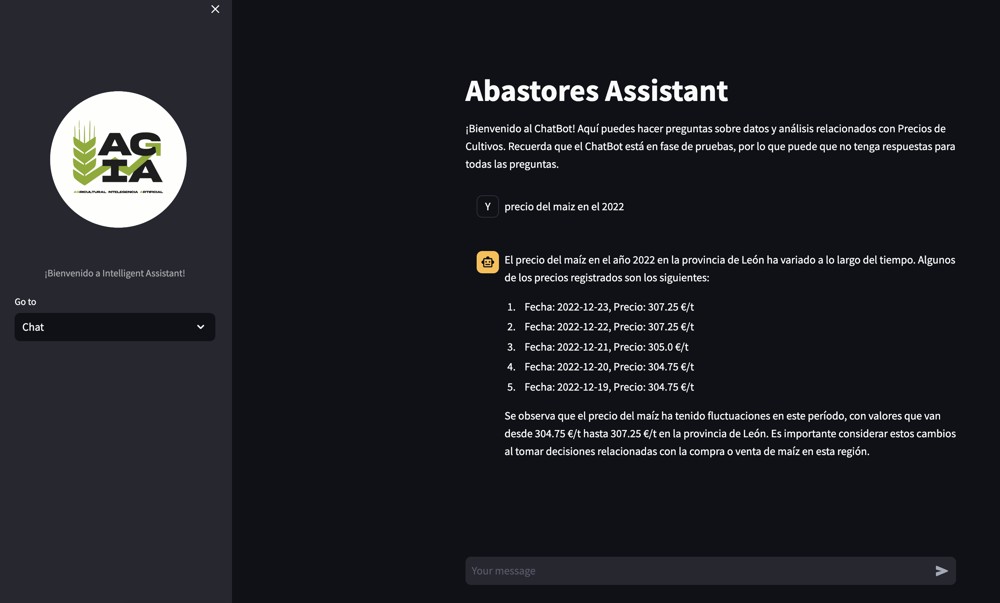

# ChatBot 
     


## Overview
This project aims to create a chatbot capable of making queries to a transactional database by creating queries to utilize the relevant information found to respond to user-generated queries.

<p align="center">
  
</p>

## Setup Instructions
1. Clone the Repository:
    ```html
    git clone https://github.com/despinoza119/streamlit_deploy_app.git
    ```

2. Install requirements
    ```html
    pip install -r requirements.txt
    ```

3. Define the necessary environment variables:
    ```html
    OPENAI_API_KEY=
    ```

4. Run the streamlit app:
    ```html
    streamlit run app.py
    ```

5. To visualize the app go to http://localhost:8501 :
    ```html
    http://localhost:8501
    ```

## Documentation

## License
MIT License
